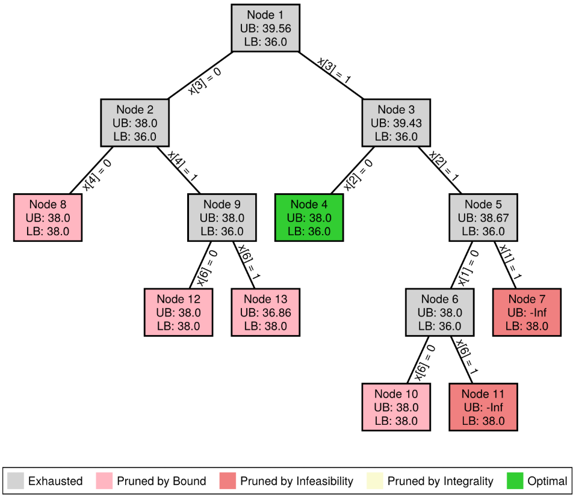
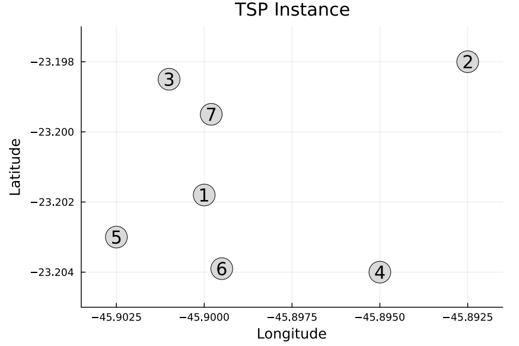
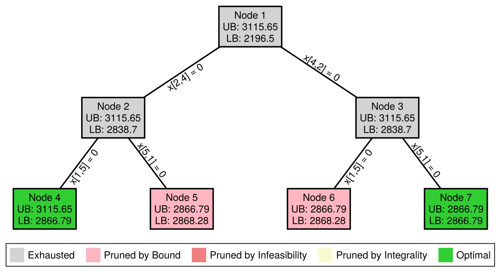
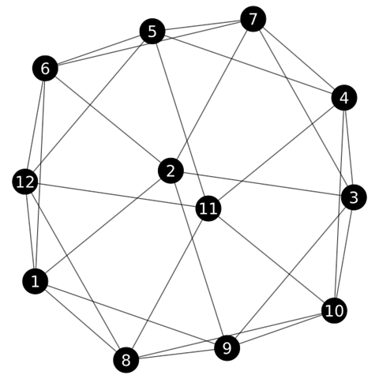
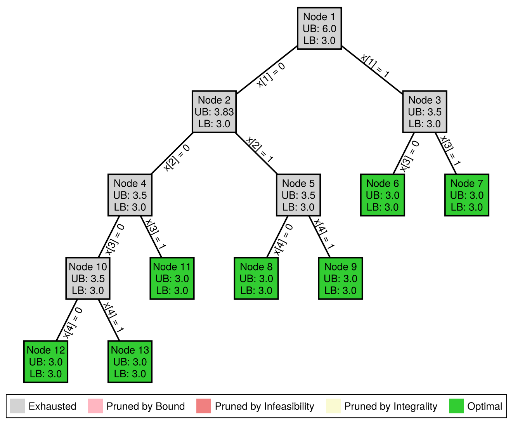

# Examples

This page collects complete usage examples for `BnB.jl`.

---

## Example 1: Binary Knapsack Problem

The following example solves the Binary Knapsack Problem (BKP) using Linear Programming relaxation in each node.

### What this example does

The BKP instance is a small binary knapsack problem:

- each item has a value `v = [8, 16, 20, 12, 6, 10, 4]`
- each item has a weight `w = [3, 7, 9, 6, 3, 5, 2]`
- the knapsack capacity is `W = 17`

The goal is to maximize total value without exceeding the capacity.

```julia
using BnB   # BnB Framework
using JuMP  # Modeling language
using HiGHS # Solver

# Structure to represent the BKP data
struct BKPData <: BnB.BnBData
    v::Vector{Int64} # values
    w::Vector{Int64} # weights
    W::Int64         # capacity
    n::Int           # number of items
    # Constructor
    function BKPData(;v::Vector{Int64}, w::Vector{Int64}, W::Int64)
        return new(v, w, W, length(v))
    end
end

# Structure to represent the branch constraint
struct FixVariable <: BnB.BnBBranchConstraint
    i::Int64     # Variable index
    value::Int64 # Value to fix
end

# Function to find an initial incumbent solution using a greedy heuristic based on value-to-weight ratio
function BnB.custom_incumbent(data::BKPData)
    # Value-to-weight ratios
    ratios = data.v ./ data.w
    # Sort items by decreasing ratio
    order = sortperm(ratios, rev=true)
    # Initialize solution vector
    solution = zeros(Int, data.n)
    # Greedy filling based on sorted order
    remaining_capacity = data.W
    incumbent_objective = 0.0
    for i in order
        if data.w[i] <= remaining_capacity
            solution[i] = 1
            remaining_capacity -= data.w[i]
            incumbent_objective += data.v[i]
        end
    end
    return BnB.BnBSolution(solution=solution, objective=incumbent_objective)
end

# Function to solve the LP relaxation of the BKP for a given node
function BnB.custom_relaxation(node::BnB.BnBNode, bnb::BnB.BnBCore)
    model = JuMP.Model(HiGHS.Optimizer)
    JuMP.set_silent(model)
    @variable(model, 0 <= x[i in 1:bnb.data.n] <= 1)
    @objective(model, Max, sum(bnb.data.v[i] * x[i] for i in 1:bnb.data.n))
    @constraint(model, sum(bnb.data.w[i] * x[i] for i in 1:bnb.data.n) <= bnb.data.W)
    # Add constraints for fixed variables
    for branch in node.branch_constraints
        @constraint(model, x[branch.i] == branch.value)
    end
    JuMP.optimize!(model)
    if JuMP.termination_status(model) == JuMP.OPTIMAL
        return BnB.BnBSolution(solution=JuMP.value.(x), objective=JuMP.objective_value(model))
    end
end

# Function to check pruning conditions for a given node and update its status accordingly
function BnB.custom_prune(node::BnB.BnBNode, bnb::BnB.BnBCore)
    # 1. Prune by Infeasibility
    if isnothing(node.relaxation.solution)
        return BnB.PrunedByInfeasibility
    end
    # 2. Prune by Integrality
    if !any(x -> 1e-5 < x < (1 - 1e-5), node.relaxation.solution)
        return BnB.PrunedByIntegrality
    end
    # 3. Prune by Bound
    if node.relaxation.objective <= bnb.incumbent.objective
        return BnB.PrunedByBound
    end
    return BnB.Active
end

# Function to select the branches and the values to fix for a given node
function BnB.custom_branch(node::BnB.BnBNode, bnb::BnB.BnBCore)
    # Create two branches: one excluding the edge and one including the edge
    branch_constraints = Vector{BnB.BnBBranchConstraint}()
    # Find all fractional variables in the solution
    fractional_variables = findall(x -> 1e-5 < x < (1 - 1e-5), node.relaxation.solution)
    # Create branches
    for var in fractional_variables
        left_branch = FixVariable(var, 0)
        right_branch = FixVariable(var, 1)
        # Check if the variable is already fixed to 0.0 in the current node
        if left_branch in node.branch_constraints || right_branch in node.branch_constraints
            continue
        end
        push!(branch_constraints, left_branch)  # Left branch: exclude the item
        push!(branch_constraints, right_branch) # Right branch: include the item
        return branch_constraints
    end
end

# Function to determine if a node contains an optimal solution
function BnB.custom_is_optimal_solution(node::BnB.BnBNode, bnb::BnB.BnBCore)
    # Check if the node has a valid solution
    if isnothing(node.relaxation.solution)
        return false
    end
    # Check if the solution is integral (i.e., all variables are either 0 or 1)
    is_integral = !any(x -> 1e-5 < x < (1 - 1e-5), node.relaxation.solution)
    # Check if the relaxation value matches the best incumbent objective value within a tolerance
    is_optimal = isapprox(node.relaxation.objective, bnb.incumbent.objective; atol=1e-6)
    # It is optimal if it has an integral solution and its relaxation value matches the incumbent objective value
    if is_integral && is_optimal
        return true
    end
    return false
end

# Example
data = BKPData(
    v = [8, 16, 20, 12, 6, 10, 4],
    w = [3, 7, 9, 6, 3, 5, 2],
    W = 17
)

# Define plot options for this example
custom_plot_options = BnB.BnBPlotOptions(
    figure_size = (750, 650),
    node_size = (130, 90),
    node_label_size = 14,
    edge_label_size = 14,
    show_legend = true,
    legend_position = :bottom,
    branch_label = (branch::FixVariable) -> "x[$(branch.i)] = $(branch.value)"
)

# Solve the BKP using the BnB framework
solution = BnB.solve(data, is_maximization = true, search_strategy = :best_bound, custom_plot_options = custom_plot_options)
```

The following output presents the result after executing the presented julia code.

```
========== Branch-and-Bound Completed ==========

Total time: 0.04331803321838379 seconds
Best solution: [1.0, -0.0, 1.0, 0.0, 0.0, 1.0, -0.0]
Objective value: 38.0

Nodes explored: 13
Nodes pruned: 6
Pruning statistics:
	- Pruned by infeasibility: 2
	- Pruned by integrality: 0
	- Pruned by bound: 4

=================================================
Search Tree
=================================================

└── Node 1 (39.56) 
    ├── Node 2 (38.0) 
    │   ├── Node 8 (38.0) ✂️
    │   └── Node 9 (38.0) 
    │       ├── Node 12 (38.0) ✂️
    │       └── Node 13 (36.86) ✂️
    └── Node 3 (39.43) 
        ├── Node 4 (38.0) ⭐
        └── Node 5 (38.67) 
            ├── Node 6 (38.0) 
            │   ├── Node 10 (38.0) ✂️
            │   └── Node 11 (-Inf) 🚫
            └── Node 7 (-Inf) 🚫

Legend:

	🔒 : Pruned by Integrality
	🚫 : Pruned by Infeasibility
	✂️ : Pruned by Bound
	⭐ : Optimal

=================================================
```

The Julia code also provides the following Branch-and-Bound tree.

```@raw html
<div style="text-align: center;">
    
</div>
```

---

## Example 2: Travelling Salesman Problem

The following example solves the Travelling Salesman Problem (TSP) using Linear Programming relaxation in each node.

### What this example does

The TSP instance file is composed by 7 cities:

```math
coordinates = \begin{bmatrix}
-23.2018 & -45.9000 \\
-23.1980 & -45.8925 \\
-23.1985 & -45.9010 \\
-23.2040 & -45.8950 \\
-23.2030 & -45.9025 \\
-23.2039 & -45.8995 \\
-23.1995 & -45.8998
\end{bmatrix}
```



The goal is to find the shortest possible route that allows a traveler to visit a set of cities exactly once and return to the starting city.

```julia
using BnB       # BnB Framework
using JuMP      # Modeling language
using HiGHS     # Solver
using CSV       # Data handling
using Distances # Distance computations

# Structure to represent the TSP data
struct TSPData <: BnB.BnBData
    coordinates::Matrix{Float64}     # City coordinates
    distance_matrix::Matrix{Float64} # Precomputed distance matrix
    n::Int                           # Number of cities
    # Constructor
    function TSPData(;file_path::String)
        coordinates = CSV.read(file_path, CSV.Tables.matrix, header=false)
        distance_matrix = Distances.pairwise(Distances.Haversine(), coordinates, dims=1)
        return new(coordinates, distance_matrix, size(coordinates, 1))
    end
end

# Structure to represent the branch constraint
struct FixVariable <: BnB.BnBBranchConstraint
    i::Int64     # Variable index i 
    j::Int64     # Variable index j
    value::Int64 # Value to fix
end

# Function to find an initial incumbent solution using the Nearest Neighbor heuristic
function BnB.custom_incumbent(data::TSPData)
    visited = falses(data.n)
    solution = zeros(Int, data.n)
    # Start from the first city
    current_city = 1
    solution[1] = current_city
    visited[current_city] = true
    incumbent_objective = 0.0
    for k in 2:data.n
        # Find the nearest unvisited city
        next_city = argmin([visited[j] ? Inf : data.distance_matrix[current_city, j] for j in 1:data.n])
        solution[k] = next_city
        visited[next_city] = true
        incumbent_objective += data.distance_matrix[current_city, next_city]
        current_city = next_city
    end
    # Add the distance to return to the starting city
    incumbent_objective += data.distance_matrix[current_city, solution[1]]
    return BnB.BnBSolution(solution=solution, objective=incumbent_objective)
end

# Function to solve the LP relaxation of the TSP for a given node
function BnB.custom_relaxation(node::BnB.BnBNode, bnb::BnB.BnBCore)
    model = JuMP.Model(HiGHS.Optimizer)
    JuMP.set_silent(model)
    @variable(model, x[i in 1:bnb.data.n, j in 1:bnb.data.n], Bin)
    @objective(model, Min, sum(bnb.data.distance_matrix[i, j] * x[i, j] for i in 1:bnb.data.n, j in 1:bnb.data.n))
    @constraint(model, [i in 1:bnb.data.n], x[i, i] == 0)
    @constraint(model, [j in 1:bnb.data.n], sum(x[i, j] for i in 1:bnb.data.n) == 1)
    @constraint(model, [i in 1:bnb.data.n], sum(x[i, j] for j in 1:bnb.data.n) == 1)
    # Add constraints for fixed variables
    for branch in node.branch_constraints
        @constraint(model, x[branch.i, branch.j] == branch.value)
    end
    JuMP.optimize!(model)
    if JuMP.termination_status(model) == JuMP.OPTIMAL
        # Extract the routes from the solution
        x_val = JuMP.value.(x)
        # Identify cycles in the solution to check for integrality and to identify subtours
        visited = fill(false, bnb.data.n)
        cycles = Vector{Vector{Int}}()
        for start in 1:bnb.data.n
            if !visited[start]
                cycle = Int[start]
                visited[start] = true
                nxt = findfirst(x_val[start, :] .> 0.5)
                while nxt !== nothing && !visited[nxt]
                    push!(cycle, nxt)
                    visited[nxt] = true
                    nxt = findfirst(x_val[nxt, :] .> 0.5)
                end
                push!(cycles, cycle)
            end
        end
        # return cycles, JuMP.objective_value(model)
        return BnB.BnBSolution(solution=cycles, objective=JuMP.objective_value(model))
    end
end

# Function to check pruning conditions for a given node and update its status accordingly
function BnB.custom_prune(node::BnB.BnBNode, bnb::BnB.BnBCore)
    # 1. Prune by Infeasibility
    if isnothing(node.relaxation.objective)
        return BnB.PrunedByInfeasibility
    end
    # 2. Prune by Integrality
    if length(node.relaxation.solution) == 1
        return BnB.PrunedByIntegrality
    end
    # 3. Prune by Bound
    if node.relaxation.objective >= bnb.incumbent.objective
        return BnB.PrunedByBound
    end
    return BnB.Active
end

# Function to select the branches and the values to fix for a given node
function BnB.custom_branch(node::BnB.BnBNode, bnb::BnB.BnBCore)
    # Create two branches: one excluding the edge and one including the edge
    branch_constraints = Vector{BnB.BnBBranchConstraint}()
    # Sort cycles by length to prioritize branching on the smallest subtour
    subtours = sort(node.relaxation.solution, by=length)
    # Select the first edge of the smallest subtour for branching
    for subtour in subtours
        # Iterate through the edges of the subtour and find the first edge that is not already fixed to 0.0 in the current node
        for i in 1:(length(subtour) - 1)
            left_branch = FixVariable(subtour[i], subtour[i+1], 0)
            right_branch = FixVariable(subtour[i+1], subtour[i], 0)
            # Check if the edge is already fixed to 0 in the current node
            if left_branch in node.branch_constraints || right_branch in node.branch_constraints
                continue
            end
            push!(branch_constraints, left_branch)  # Left branch: exclude the edge
            push!(branch_constraints, right_branch) # Right branch: exclude the reverse edge
            return branch_constraints
        end
    end
end

# Function to determine if a node contains an optimal solution
function BnB.custom_is_optimal_solution(node::BnB.BnBNode, bnb::BnB.BnBCore)
    # Check if the node has a valid solution
    if isnothing(node.relaxation.solution)
        return false
    end
    # Check if the solution is integral (i.e., forms a single cycle)
    is_integral = length(node.relaxation.solution) == 1
    # Check if the relaxation value matches the best incumbent objective value within a tolerance
    is_optimal = isapprox(node.relaxation.objective, bnb.incumbent.objective; atol=1e-6)
    # A node is considered optimal if it has an integral solution and its relaxation value matches the incumbent objective value
    if is_integral && is_optimal
        return true
    end
    return false
end

# Example
data = TSPData(file_path="data/tsp_instance.csv")

# Define plot options for this example
custom_plot_options = BnB.BnBPlotOptions(
    figure_size = (750, 400),
    node_size = (140, 90),
    node_label_size = 14,
    edge_label_size = 14,
    show_legend = true,
    legend_position = :bottom,
    branch_label = (branch::FixVariable) -> "x[$(branch.i),$(branch.j)] = $(branch.value)"
)

# Solve the TSP using the BnB framework
solution = BnB.solve(data, is_maximization = false, search_strategy = :best_bound, custom_plot_options = custom_plot_options)
```

The following output presents the result after executing the presented julia code.

```
========== Branch-and-Bound Completed ==========

Total time: 0.26796483993530273 seconds
Best solution: [[1, 6, 4, 2, 7, 3, 5]]
Objective value: 2866.791690832384

Nodes explored: 7
Nodes pruned: 2
Pruning statistics:
	- Pruned by infeasibility: 0
	- Pruned by integrality: 0
	- Pruned by bound: 2

=================================================
Search Tree
=================================================

└── Node 1 (2196.5) 
    ├── Node 2 (2838.7) 
    │   ├── Node 4 (2866.79) ⭐
    │   └── Node 5 (2868.28) ✂️
    └── Node 3 (2838.7) 
        ├── Node 6 (2868.28) ✂️
        └── Node 7 (2866.79) ⭐

Legend:

	🔒 : Pruned by Integrality
	🚫 : Pruned by Infeasibility
	✂️ : Pruned by Bound
	⭐ : Optimal

=================================================
```

The Julia code also provides the following Branch-and-Bound tree.

```@raw html
<div style="text-align: center;">
    
</div>
```

---

## Example 3: Maximum Independent Set Problem

The following example solves the Maximum Independent Set Problem (MISP).

### Problem Definition

Given an undirected graph $G=(V,E)$ composed of a set of $V$ vertices and $E$ edges, an **independent set** is a subset of vertices ($S \subseteq V$) such that no two vertices in ($S$) are adjacent. The goal is to find the largest independent set.

This problem is defined by the following model, in which the objective if to maximize the number of selected vertices.

```math
\begin{aligned}
\max \quad & \sum_{i \in V} x_i \\
\text{s.t.} \quad & x_i + x_j \le 1, && \forall (i,j) \in E, && (1)\\
                  & x_i \in \{0,1\}, && \forall i \in V && (2)
\end{aligned}
```

The variables $x_i$ are defined for each vertex $i \in V$, and controls if it is selected to be part of the independent set or not. The constraints (1) defines, for every edge ($(i,j) \in E$), that at most one endpoint can belong to the independent set.

### Solution

In this example we implement a branch-and-cut, since the Linear Programming relaxation with only edge constraints is weak.

For example, consider a triangle:

```
1
|\
| \
2--3
```

Edge constraints are:

```math
\begin{aligned}
x_1+x_2 \le 1
x_1+x_3 \le 1
x_2+x_3 \le 1
\end{aligned}
```

The fractional solution $x_1=x_2=x_3=0.5$ is feasible with objective $1.5$. However, an independent set can contain only one vertex.

To prevent this we use a separation heuristic that search for cliques in the graph and insert clique inequalities. Thus, for any clique ($C$):

```math
\begin{aligned}
\sum_{v\in C} x_v \le 1
\end{aligned}
```

For the triangle in our example:

```math
\begin{aligned}
x_1+x_2+x_3 \le 1
\end{aligned}
```

which cuts off the fractional solution. The logic to find the cliques in implemented in `find_violated_cliques_multi(...)` function.

### Example

The MISP instance is a graph: 

```math
A = \begin{bmatrix}
0 & 1 & 0 & 0 & 0 & 1 & 0 & 1 & 1 & 0 & 0 & 1 \\
1 & 0 & 1 & 0 & 0 & 1 & 1 & 0 & 1 & 0 & 0 & 0 \\
0 & 1 & 0 & 1 & 0 & 0 & 1 & 0 & 1 & 1 & 0 & 0 \\
0 & 0 & 1 & 0 & 1 & 0 & 1 & 0 & 0 & 1 & 1 & 0 \\
0 & 0 & 0 & 1 & 0 & 1 & 1 & 0 & 0 & 0 & 1 & 1 \\
1 & 1 & 0 & 0 & 1 & 0 & 1 & 0 & 0 & 0 & 0 & 1 \\
0 & 1 & 1 & 1 & 1 & 1 & 0 & 0 & 0 & 0 & 0 & 0 \\
1 & 0 & 0 & 0 & 0 & 0 & 0 & 0 & 1 & 1 & 1 & 1 \\
1 & 1 & 1 & 0 & 0 & 0 & 0 & 1 & 0 & 1 & 0 & 0 \\
0 & 0 & 1 & 1 & 0 & 0 & 0 & 1 & 1 & 0 & 1 & 0 \\
0 & 0 & 0 & 1 & 1 & 0 & 0 & 1 & 0 & 1 & 0 & 1 \\
1 & 0 & 0 & 0 & 1 & 1 & 0 & 1 & 0 & 0 & 1 & 0
\end{bmatrix}
```

<div align="center">



</div>

The following code implements the Branch-and-Cut to solve the MISP.

```julia
using BnB    # BnB Framework
using JuMP   # Modeling language
using HiGHS  # Solver
using Graphs # Graphs package
using Random # For random shuffling in the heuristic

# Structure to represent the MISP data
struct MISPData <: BnB.BnBData
    graph::Graphs.SimpleGraph # Graph structure
    n::Int64                  # Number of vertices
    m::Int64                  # Number of edges
    # Constructor
    function MISPData(graph::Graphs.SimpleGraph)
        n = Graphs.nv(graph)
        m = Graphs.ne(graph)
        return new(graph, n, m)
    end
end

# Structure to represent the branch constraint
struct FixVariable <: BnB.BnBBranchConstraint
    v::Int64     # Variable index
    value::Int64 # Value to fix
end

# Function to find an initial incumbent solution using a greedy heuristic
function BnB.custom_incumbent(data::MISPData)
    graph = data.graph
    # Initialize the independent set and a set to track selected vertices
    independent_set = Set{Int}()
    selected = falses(data.n)
    # Iterate over vertices in order of degree (lowest degree first)
    for v in sort(1:data.n, by=v -> Graphs.degree(graph, v))
        if !selected[v]
            push!(independent_set, v)
            selected[v] = true
            # Mark neighbors as selected to prevent their inclusion
            for neighbor in Graphs.neighbors(graph, v)
                selected[neighbor] = true
            end
        end
    end
    return BnB.BnBSolution(solution=independent_set, objective=length(independent_set))
end

# A simple heuristic to find a violated clique inequalities
function find_violated_cliques_multi(g, x; K=10)
    n = nv(g)
    cliques = Set{Set{Int}}()
    base = filter(v -> x[v] > 1e-4, 1:n)
    # Try multiple random orders to find different violated cliques
    for seed in 1:K
        # Random order of candidates to get different cliques in each iteration
        candidates = copy(base)
        shuffle!(candidates)
        sort!(candidates, by=v->x[v], rev=true)
        clique = Set{Int}()
        weight = 0.0
        for v in candidates
            if all(u -> has_edge(g,u,v), clique)
                push!(clique, v)
                weight += x[v]
            end
        end
        # Only consider cliques of size >= 3 that violate the inequality
        if length(clique) >= 3 && weight > 1 + 1e-4
            push!(cliques, clique)
        end
    end
    return cliques
end

# Function to solve the relaxation of the MISP for a given node using Cutting Planes
function BnB.custom_relaxation(node::BnB.BnBNode, bnb::BnB.BnBCore)
    # Create the model
    model = JuMP.Model(HiGHS.Optimizer)
    # Silent mode (solver output is not printed)
    JuMP.set_silent(model)
    # Define the decision variables
    @variable(model, 0 <= x[v in 1:bnb.data.n] <= 1)
    # Objective function
    @objective(model, Max, sum(x[v] for v in 1:bnb.data.n))
    # Base Independence constraint (Edge Constraints)
    for e in Graphs.edges(bnb.data.graph)
        @constraint(model, x[e.src] + x[e.dst] <= 1)
    end
    # Add constraints for fixed variables from the BnB node
    for branch in node.branch_constraints
        @constraint(model, x[branch.v] == branch.value)
    end
    # Add cutting planes
    for clique in bnb.global_cuts
        @constraint(model, sum(x[v] for v in clique) <= 1)
    end
    # Run the solver
    JuMP.optimize!(model)
    # Check for violated clique constraints and add them to the global cut pool
    violated_cliques = find_violated_cliques_multi(bnb.data.graph, JuMP.value.(x), K=20)
    for violated_clique in violated_cliques
        if !isempty(violated_clique) && !(violated_clique in bnb.global_cuts)
            push!(bnb.global_cuts, violated_clique)
        end
    end
    if JuMP.termination_status(model) == JuMP.OPTIMAL
        return BnB.BnBSolution(solution=JuMP.value.(x), objective=JuMP.objective_value(model))
    end
end

# Function to check pruning conditions for a given node and update its status accordingly
function BnB.custom_prune(node::BnB.BnBNode, bnb::BnB.BnBCore)
    # 1. Prune by Infeasibility
    if isnothing(node.relaxation.solution)
        return BnB.PrunedByInfeasibility
    end
    # 2. Prune by Integrality
    if !any(x -> 1e-5 < x < (1 - 1e-5), node.relaxation.solution)
        return BnB.PrunedByIntegrality
    end
    # 3. Prune by Bound
    if node.relaxation.objective <= bnb.incumbent.objective
        return BnB.PrunedByBound
    end
    return BnB.Active
end

# Function to select the branches and the values to fix for a given node
function BnB.custom_branch(node::BnB.BnBNode, bnb::BnB.BnBCore)
    # Create two branches: one excluding the edge and one including the edge
    branch_constraints = Vector{BnB.BnBBranchConstraint}()
    # Find all fractional variables in the solution
    fractional_variables = findall(x -> 1e-5 < x < (1 - 1e-5), node.relaxation.solution)
    # Create branches
    for var in fractional_variables
        left_branch = FixVariable(var, 0)
        right_branch = FixVariable(var, 1)
        # Check if the variable is already fixed in the current node
        if left_branch in node.branch_constraints || right_branch in node.branch_constraints
            continue
        end
        push!(branch_constraints, left_branch)  # Left branch: exclude the vertice
        push!(branch_constraints, right_branch) # Right branch: include the vertice
        return branch_constraints
    end
end

# Function to determine if a node contains an optimal solution
function BnB.custom_is_optimal_solution(node::BnB.BnBNode, bnb::BnB.BnBCore)
    # Check if the node has a valid solution
    if isnothing(node.relaxation.solution)
        return false
    end
    # Check if the solution is integral (i.e., all variables are either 0 or 1)
    is_integral = !any(x -> 1e-5 < x < (1 - 1e-5), node.relaxation.solution)
    # Check if the relaxation value matches the best incumbent objective value within a tolerance
    is_optimal = isapprox(node.relaxation.objective, bnb.incumbent.objective; atol=1e-6)
    # It is optimal if it has an integral solution and its relaxation value matches the incumbent objective value
    if is_integral && is_optimal
        return true
    end
    return false
end

# Example
graph = Graphs.smallgraph("icosahedral")
data = MISPData(graph)

# Define plot options for this example
custom_plot_options = BnB.BnBPlotOptions(
    figure_size = (750, 650),
    node_size = (95, 90),
    node_label_size = 14,
    edge_label_size = 14,
    show_legend = true,
    legend_position = :bottom,
    branch_label = (branch::FixVariable) -> "x[$(branch.v)] = $(branch.value)"
)

# Solve the MISP using the BnB framework
Random.seed!(42) # Set a random seed for reproducibility
solution = BnB.solve(data, is_maximization = true, search_strategy = :best_bound, custom_plot_options = custom_plot_options)
```

The following output presents the result after executing the presented julia code.

```
========== Branch-and-Bound Completed ==========

Total time: 0.5505459308624268 seconds
Best solution: Set([5, 3, 1])
Objective value: 3.0

Nodes explored: 13
Nodes pruned: 0
Pruning statistics:
	- Pruned by infeasibility: 0
	- Pruned by integrality: 0
	- Pruned by bound: 0

Cuts generated: 14

=================================================
Search Tree
=================================================

└── Node 1 (6.0) 
    ├── Node 2 (3.83) 
    │   ├── Node 4 (3.5) 
    │   │   ├── Node 10 (3.5) 
    │   │   │   ├── Node 12 (3.0) ⭐
    │   │   │   └── Node 13 (3.0) ⭐
    │   │   └── Node 11 (3.0) ⭐
    │   └── Node 5 (3.5) 
    │       ├── Node 8 (3.0) ⭐
    │       └── Node 9 (3.0) ⭐
    └── Node 3 (3.5) 
        ├── Node 6 (3.0) ⭐
        └── Node 7 (3.0) ⭐

Legend:

	🔒 : Pruned by Integrality
	🚫 : Pruned by Infeasibility
	✂️ : Pruned by Bound
	⭐ : Optimal

=================================================
```

The Julia code also provides the following Branch-and-Bound tree.

```@raw html
<div style="text-align: center;">
    
</div>
```