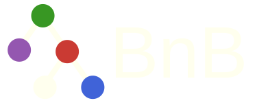

```@raw html
<div style="text-align: center;">
    
    
</div>
```

# Introduction

`BnB.jl` provides a customizable branch-and-bound framework for binary decision problems.

## Installation

```julia
using Pkg
Pkg.add(url="https://github.com/Luiz-Lorena/BnB.jl")
```

## Quick Start


For a complete mixed-integer example using JuMP and HiGHS, see [Examples](@ref).
